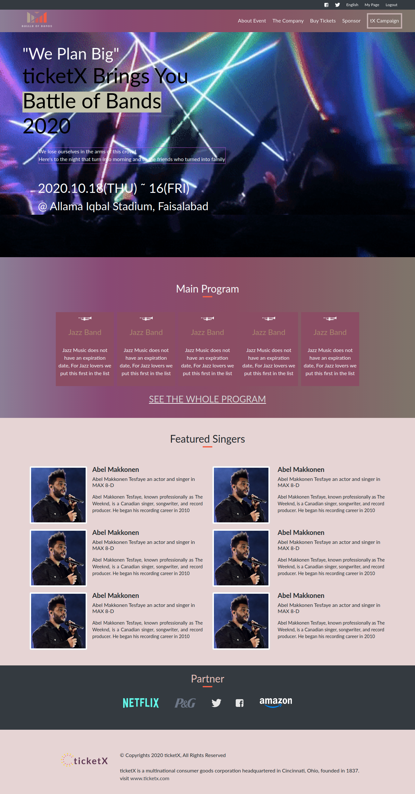

# ticketX
This html/css capstone project is a website for concert details like artists, schedule and ticket pricing.
Using bootstrap and media queries to achieve responsiveness. CSS flexbox is extensively used throughout the project to get the better layout for different screen sizes.
Feature od the projects includes concert schedule, sponsors, ticket prices as well as ticket purchase option (for now it only has front-end and doesn't actually book ticket).

## Built With

- Html5
- CSS3
- Bootstrap 4

## Getting Started

- To clone enter this command in your terminal 
- `git clone git@github.com:UmairAhmad125/ticketX.git`
- `cd` into the project directory 
- Run `git checkout -b your-branch-name` e.g `git checkout -b feature`

## 🤝 Contributing

Contributions, issues and feature requests are welcome! Start by:

- Forking the project
- Cloning the project to your local machine 
- `cd` into the project directory 
- Run `git checkout -b your-branch-name`
- Make your contributions
- Push your branch up to your forked repository
- Open a Pull Request with a detailed description to the development branch of the original project for a review

## Live Demo

[Live Demo Link](https://rawcdn.githack.com/UmairAhmad125/ticketX/886fa1db7071ecb6f555f32eeb56078806bf7021/index.html)

## Project Presentation

[Loom video link](https://www.loom.com/share/bd6754ce3bf041949a4fba52cb457a2c)

## Author

👤 **Umair Ahmad**

- Github: [@umairahmad125](https://github.com/UmairAhmad125)
- Linkedin: https://www.linkedin.com/in/umair-ahmad-b5a89015a/
- Twitter: [@umairahmadDP](https://twitter.com/umairahmadDP)
- email: (umairahmad125@gmail.com)

## Show your support

Give a ⭐️ if you like this project!

## Acknowledgments

- Design Credit [Cindy Shin](https://www.behance.net/gallery/29845175/CC-Global-Summit-2015)
- Project inspired by Microverse Program

